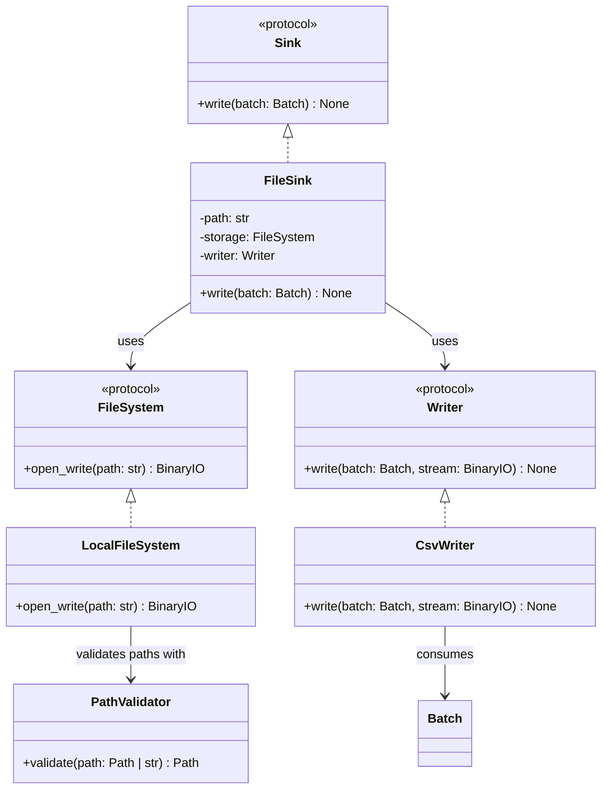

# FileSink

## Purpose

`FileSink` is a sink component responsible for writing FlowForge `Batch` objects to a configured file resource.

It composes two independent components:

* `FileSystem`, which provides a writable binary stream for the destination.
* `Writer`, which serializes a `Batch` into the supplied stream.

`FileSink` does not depend on a particular storage implementation or file format. This allows it to work with `LocalFileSystem` and future storage implementations, as well as `CsvWriter` and future writers, without changing its implementation.

## Class Diagram



## Responsibilities

### FileSink

`FileSink` is responsible for:

* Storing the configured destination path.
* Opening the destination through the supplied `FileSystem`.
* Passing the `Batch` and writable stream to the supplied `Writer`.
* Ensuring the stream is closed after writing, including when writing fails.
* Implementing the `Sink` interface.

`FileSink` is **not** responsible for:

* Implementing filesystem operations.
* Validating local filesystem path containment.
* Serializing CSV or other file formats.
* Transforming or constructing `Batch` objects.
* Selecting a storage backend or writer implementation.
* Orchestrating pipeline execution.
* Implementing application-level logging.

### FileSystem

`FileSystem` defines the storage contract used to open the destination for writing.

Its implementations handle storage-specific behavior, such as local path validation and opening local files.

`FileSink` depends on the protocol rather than directly on `LocalFileSystem`.

### Writer

`Writer` defines the contract for serializing a `Batch` into a binary stream.

Its implementations handle format-specific serialization. For example, `CsvWriter` uses PyArrow to write CSV data to the supplied stream.

`FileSink` does not need to know how the writer serializes the batch.

## Dependency Relationship

```text
Sink
 ▲
 │ implements
 │
FileSink
 ├── FileSystem
 │      └── LocalFileSystem
 │              └── PathValidator
 │
 └── Writer
        └── CsvWriter
```

`FileSink` depends on the `FileSystem` and `Writer` protocols, not their concrete implementations.

This enables different combinations without modifying `FileSink`:

```text
LocalFileSystem + CsvWriter
LocalFileSystem + ParquetWriter
S3Storage       + CsvWriter
HdfsStorage     + CsvWriter
```

Additional combinations can be supported as new storage and writer implementations are introduced.

## Data Flow

The sink coordinates the following operations:

```text
FileSink.write(batch)
        │
        ▼
FileSystem.open_write(path)
        │
        ▼
   BinaryIO stream
        │
        ▼
Writer.write(batch, stream)
        │
        ▼
 Serialized file data
        │
        ▼
    filesystem
```

The storage implementation provides the writable stream. The writer serializes the batch into that stream.

The stream is managed using a context manager so that it is closed after writing, including if serialization raises an exception.

In the initial implementation, each call to `FileSink.write()` writes one `Batch` to the configured destination.

## Interface

### FileSink

```python
from flowforge.core.batch import Batch
from flowforge.core.writer import Writer
from flowforge.storage.filesystem import FileSystem


class FileSink:
    def __init__(
        self,
        path: str,
        storage: FileSystem,
        writer: Writer,
    ) -> None:
        ...

    def write(self, batch: Batch) -> None:
        ...
```

## Contract

| Operation                                | Expected behavior                                                      |
| ---------------------------------------- | ---------------------------------------------------------------------- |
| Construct with path, storage, and writer | Stores the supplied dependencies and destination path                  |
| Write a valid batch                      | Serializes the batch and writes it to the destination                  |
| Write to a new valid destination         | Creates the destination when supported by the storage implementation   |
| Write to an invalid local path           | Propagates the path-validation error from local storage                |
| Write when storage access fails          | Propagates the underlying storage error                                |
| Write when serialization fails           | Propagates the writer's exception                                      |
| Complete a write                         | Closes the opened stream                                               |
| Supply another storage implementation    | Works without modifying `FileSink`, provided it satisfies `FileSystem` |
| Supply another writer implementation     | Works without modifying `FileSink`, provided it satisfies `Writer`     |

Exceptions are propagated rather than wrapped in a new `FileSink` exception hierarchy.

The behavior for empty batches is determined by the supplied writer. For example, the current `CsvWriter` raises `WriterError` when the batch contains no rows.

## SOLID Considerations

### Single Responsibility Principle

`FileSink` has one primary responsibility: coordinating storage access and serialization to deliver a batch to a file resource.

It does not implement filesystem operations or format-specific serialization.

### Open/Closed Principle

New storage backends and writer implementations can be introduced without modifying `FileSink`.

For example, adding `ParquetWriter` or `S3Storage` does not require changes to the sink implementation.

No factory, registry, or plugin framework is required at this stage.

### Liskov Substitution Principle

Any implementation satisfying `FileSystem` can replace another storage implementation, and any implementation satisfying `Writer` can replace another writer.

Substitutions must preserve their respective contracts, including stream behavior and exception propagation.

### Interface Segregation Principle

`FileSink` depends on two small protocols:

* `FileSystem` provides writable resource access.
* `Writer` provides format-specific serialization.

Neither protocol needs unrelated operations such as pipeline orchestration or data transformation.

### Dependency Inversion Principle

`FileSink` depends on protocols rather than concrete storage and writer classes.

This keeps sink orchestration independent of local filesystem details and particular file formats.

## Design Constraints

The initial implementation should remain small:

* Accept a destination path, `FileSystem`, and `Writer`.
* Use `FileSystem.open_write()` to obtain the output stream.
* Pass the `Batch` and stream to `Writer.write()`.
* Close the stream reliably.
* Propagate underlying exceptions.
* Avoid format detection, factories, registries, retries, and append-mode configuration until concrete requirements justify them.

The central design principle is:

**`FileSink` coordinates serialization and storage; the writer handles the format, and the storage implementation handles the destination.**
