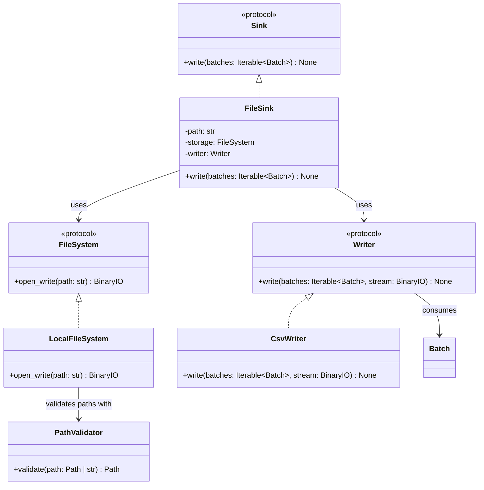

# FileSink

## Purpose

`FileSink` is a sink component responsible for writing ETLRelay batches to a configured file resource.

It composes two independent components:

* `FileSystem`, which provides a writable binary stream for the destination.
* `Writer`, which serializes an iterable of `Batch` objects into the supplied stream.

`FileSink` does not depend on a particular storage implementation or file format. This allows it to work with `LocalFileSystem` and future storage implementations, as well as `CsvWriter` and future writers, without changing its implementation.

## Class Diagram



## Responsibilities

### FileSink

`FileSink` is responsible for:

* Storing the configured destination path.
* Opening the destination through the supplied `FileSystem`.
* Passing the iterable of batches and writable stream to the supplied `Writer`.
* Opening the destination once per write operation rather than once per batch.
* Ensuring the stream is closed after writing, including when serialization fails.
* Implementing the `Sink` protocol.

`FileSink` is **not** responsible for:

* Implementing filesystem operations.
* Validating local filesystem path containment.
* Serializing CSV or other file formats.
* Transforming or constructing `Batch` objects.
* Selecting a storage backend or writer implementation.
* Orchestrating pipeline execution.
* Defining format-specific behavior for empty batches.
* Implementing application-level logging.

### FileSystem

`FileSystem` defines the storage contract used to open the destination for writing.

Its implementations handle storage-specific behavior, including resource access, opening writable streams, and any applicable path validation.

`FileSink` depends on the protocol rather than directly on `LocalFileSystem`.

### Writer

`Writer` defines the contract for serializing an iterable of `Batch` objects into a binary stream.

Its implementations handle format-specific serialization. For example, `CsvWriter` serializes batches into CSV data using PyArrow.

The writer is responsible for processing the iterable according to its contract, including handling empty batches and determining how multiple batches are represented in one output resource.

`FileSink` does not need to know how the writer serializes the batches.

## Dependency Relationship

```text
Sink
 ▲
 │ implements
 │
FileSink
 ├── FileSystem
 │      └── LocalFileSystem
 │              └── PathValidator
 │
 └── Writer
        └── CsvWriter
```

`FileSink` depends on the `FileSystem` and `Writer` protocols, not their concrete implementations.

This enables different combinations without modifying `FileSink`:

```text
LocalFileSystem + CsvWriter
LocalFileSystem + ParquetWriter
S3Storage       + CsvWriter
HdfsStorage     + CsvWriter
```

Additional combinations can be supported as new storage and writer implementations are introduced.

## Data Flow

The sink coordinates the following operations:

```text
FileSink.write(batches)
          │
          ▼
FileSystem.open_write(path)
          │
          ▼
    BinaryIO stream
          │
          ▼
Writer.write(batches, stream)
          │
          ▼
   Serialized file data
          │
          ▼
       filesystem
```

The storage implementation provides the writable stream. The writer serializes the iterable of batches into that stream.

The stream is managed using a context manager so that it is closed after writing, including when serialization raises an exception.

A single call to `FileSink.write()` represents one output operation for the configured destination. All batches supplied in that call are handled by the writer through the same stream.

The sink does not buffer the entire iterable or independently iterate over it before passing it to the writer.

## Interface

### FileSink

```python
from collections.abc import Iterable

from etlrelay.core.batch import Batch
from etlrelay.core.writer import Writer
from etlrelay.storage.filesystem import FileSystem


class FileSink:
    def __init__(
        self,
        path: str,
        storage: FileSystem,
        writer: Writer,
    ) -> None:
        ...

    def write(self, batches: Iterable[Batch]) -> None:
        ...
```

## Contract

| Operation                                  | Expected behavior                                                                     |
| ------------------------------------------ | ------------------------------------------------------------------------------------- |
| Construct with path, storage, and writer   | Stores the supplied dependencies and destination path                                 |
| Write an iterable of batches               | Delegates serialization to the supplied writer                                        |
| Write multiple batches                     | Passes all batches through a single output stream                                     |
| Write an empty iterable                    | Delegates empty-input handling to the writer                                          |
| Write an iterable containing empty batches | Delegates empty-batch handling to the writer                                          |
| Write to a new valid local destination     | Creates the destination file when the parent directory exists and access is permitted |
| Write to an invalid local path             | Propagates the path-validation error from local storage                               |
| Write when storage access fails            | Propagates the underlying storage error                                               |
| Write when serialization fails             | Propagates the writer's exception                                                     |
| Complete or fail a write                   | Closes the opened stream                                                              |
| Supply another storage implementation      | Works without modifying `FileSink`, provided it satisfies `FileSystem`                |
| Supply another writer implementation       | Works without modifying `FileSink`, provided it satisfies `Writer`                    |

Exceptions are propagated rather than wrapped in a new `FileSink` exception hierarchy.

For the current local filesystem implementation, opening a destination for writing uses binary write mode. An existing destination is therefore truncated, while a new destination is created if its parent directory exists and filesystem access is permitted. Parent directories are not created automatically.

## SOLID Considerations

### Single Responsibility Principle

`FileSink` has one primary responsibility: coordinating storage access and serialization to deliver batches to a file resource.

It does not implement filesystem operations or format-specific serialization.

### Open/Closed Principle

New storage backends and writer implementations can be introduced without modifying `FileSink`.

For example, adding `ParquetWriter` or `S3Storage` does not require changes to the sink implementation.

No factory, registry, or plugin framework is required at this stage.

### Liskov Substitution Principle

Any implementation satisfying `FileSystem` can replace another storage implementation, and any implementation satisfying `Writer` can replace another writer.

Substitutions must preserve their respective contracts, including writable-stream behavior, iterable consumption, and exception propagation.

### Interface Segregation Principle

`FileSink` depends on two small protocols:

* `FileSystem` provides writable resource access.
* `Writer` provides format-specific serialization.

Neither protocol needs unrelated operations such as pipeline orchestration or data transformation.

### Dependency Inversion Principle

`FileSink` depends on protocols rather than concrete storage and writer classes.

This keeps sink orchestration independent of local filesystem details and particular file formats.

## Design Constraints

The initial implementation should remain small:

* Accept a destination path, `FileSystem`, and `Writer`.
* Use `FileSystem.open_write()` to obtain the output stream.
* Pass the iterable of batches and stream to `Writer.write()`.
* Open the destination once per write operation.
* Close the stream reliably.
* Propagate underlying exceptions.
* Avoid format detection, factories, registries, retries, and append-mode configuration until concrete requirements justify them.

The central design principle is:

**`FileSink` coordinates serialization and storage; the writer handles the format and iterable of batches, while the storage implementation handles the destination.**
