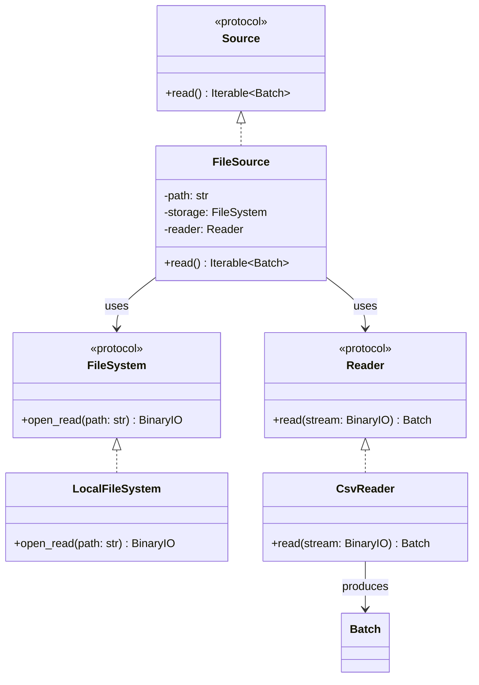

# FileSource

## Purpose

`FileSource` is a source component responsible for reading data from a configured file resource and converting it into FlowForge `Batch` objects.

It composes two independent components:

* `FileSystem`, which provides access to the resource through a binary stream.
* `Reader`, which parses the resource into a `Batch`.

`FileSource` does not depend on a particular storage implementation or file format. This allows it to work with `LocalFileSystem` and future storage implementations, as well as `CsvReader` and future readers, without changing its implementation.

## Class Diagram



## Responsibilities

### FileSource

`FileSource` is responsible for:

* Storing the configured resource path.
* Opening the resource through the supplied `FileSystem`.
* Passing the resulting binary stream to the supplied `Reader`.
* Exposing the resulting `Batch` through the `Source` interface.
* Ensuring the opened stream is closed after reading.

`FileSource` is **not** responsible for:

* Implementing filesystem operations.
* Validating local filesystem path containment.
* Parsing CSV or other file formats.
* Constructing `Batch` objects directly.
* Transforming data.
* Writing files.
* Orchestrating pipeline execution.

### FileSystem

`FileSystem` defines the contract for accessing file resources.

Its implementations are responsible for opening resources for reading and providing binary streams. Storage-specific behavior, such as local path validation, remains within the concrete storage implementation.

`FileSource` depends on the protocol rather than on `LocalFileSystem`.

### Reader

`Reader` defines the contract for parsing a binary stream into a FlowForge `Batch`.

Its implementations handle format-specific parsing. For example, `CsvReader` uses PyArrow to parse CSV data.

`FileSource` does not need to know how the supplied reader interprets the stream.

## Dependency Relationship

```text
Source
  ▲
  │ implements
  │
FileSource
  ├── FileSystem
  │      └── LocalFileSystem
  │              └── PathValidator
  │
  └── Reader
         └── CsvReader
```

`FileSource` depends on the `FileSystem` and `Reader` protocols, not their concrete implementations.

This enables different combinations without modifying `FileSource`:

```text
LocalFileSystem + CsvReader
LocalFileSystem + ParquetReader
S3Storage       + CsvReader
HdfsStorage     + CsvReader
```

Additional combinations can be supported as new storage and reader implementations are introduced.

## Data Flow

The source coordinates the following operations:

```text
FileSource.read()
       │
       ▼
FileSystem.open_read(path)
       │
       ▼
  BinaryIO stream
       │
       ▼
  Reader.read(stream)
       │
       ▼
      Batch
       │
       ▼
 Iterable[Batch]
```

In the initial implementation, one file produces one `Batch`. The source exposes the result through an iterable to satisfy the existing `Source` protocol.

The stream is managed using a context manager so that it is closed after the reader finishes consuming it.

## Interface

```python
from collections.abc import Iterable
from typing import Protocol

from flowforge.core.batch import Batch
from flowforge.core.reader import Reader
from flowforge.storage.filesystem import FileSystem


class FileSource:
    def __init__(
        self,
        path: str,
        storage: FileSystem,
        reader: Reader,
    ) -> None:
        ...

    def read(self) -> Iterable[Batch]:
        ...
```

## Contract

| Operation                                        | Expected behavior                                                        |
| ------------------------------------------------ | ------------------------------------------------------------------------ |
| Construct with path, storage, and reader         | Stores the supplied dependencies and resource path                       |
| Read a valid resource                            | Returns an iterable containing the parsed `Batch`                        |
| Read a nonexistent local file                    | Propagates the storage error                                             |
| Read an invalid CSV resource                     | Propagates the reader's parsing error                                    |
| Read a resource outside the permitted local base | Propagates the path-validation error from local storage                  |
| Complete a read                                  | Closes the opened stream                                                 |
| Supply another storage implementation            | Works without modifying `FileSource`, provided it satisfies `FileSystem` |
| Supply another reader implementation             | Works without modifying `FileSource`, provided it satisfies `Reader`     |

Exceptions are propagated rather than wrapped in a new `FileSource` exception hierarchy.

## SOLID Considerations

### Single Responsibility Principle

`FileSource` has one primary responsibility: coordinating storage access and format reading to provide batches to the pipeline.

It does not implement filesystem operations or format-specific parsing.

### Open/Closed Principle

New storage backends and reader implementations can be introduced without modifying `FileSource`.

For example, adding `ParquetReader` or `S3Storage` does not require changes to the source implementation.

No factory, registry, or plugin framework is required for this behavior.

### Liskov Substitution Principle

Any implementation satisfying `FileSystem` can replace another storage implementation, and any implementation satisfying `Reader` can replace another reader.

Substitutions must preserve the documented contracts, including stream behavior and exception propagation.

### Interface Segregation Principle

`FileSource` depends on two small protocols:

* `FileSystem` provides resource access.
* `Reader` provides format parsing.

Neither protocol needs unrelated operations such as writing, transformation, or pipeline execution.

### Dependency Inversion Principle

`FileSource` depends on protocols rather than concrete storage and reader classes.

This keeps source orchestration independent of local filesystem details and specific file formats.

## Design Constraints

The initial implementation should remain small:

* Accept a resource path, `FileSystem`, and `Reader`.
* Use `FileSystem.open_read()` to obtain the stream.
* Pass the stream to `Reader.read()`.
* Yield the resulting `Batch` through the `Source` interface.
* Close the stream reliably.
* Propagate underlying exceptions.
* Avoid format detection, factories, registries, retries, and chunking until concrete requirements justify them.

The central design principle is:

**`FileSource` coordinates resource access and parsing; the storage implementation handles the resource, and the reader handles the format.**
