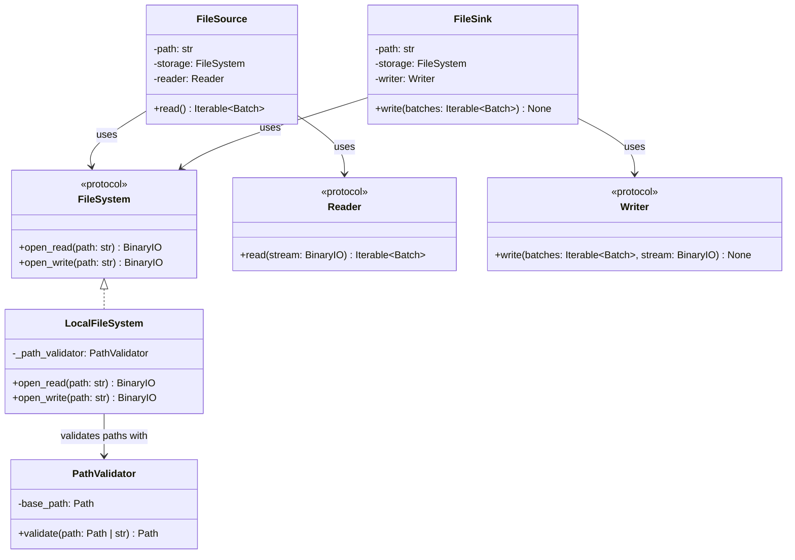

# FileSystem

## Purpose

`FileSystem` is a protocol defining the storage-access contract used by ETLRelay's file sources and sinks.

`LocalFileSystem` implements this protocol by providing readable and writable binary streams for local filesystem paths.

Storage access is separated from file-format handling. `LocalFileSystem` does not know about CSV, Parquet, `Batch`, readers, writers, sources, sinks, or pipeline orchestration.

For local filesystem security, `LocalFileSystem` uses `PathValidator` to ensure that paths resolve within the configured permitted directory.

## Class Diagram



## Responsibilities

### FileSystem

`FileSystem` defines the minimal storage contract required by file sources and sinks.

It is responsible for exposing operations that open resources as binary streams:

* `open_read()` opens a resource for reading.
* `open_write()` opens a resource for writing.

`FileSystem` is **not** responsible for:

* Parsing or serializing file formats.
* Creating or interpreting `Batch` objects.
* Implementing source or sink orchestration.
* Pipeline execution.
* Application-level logging.

The protocol is intentionally small so that multiple storage implementations can satisfy the same contract.

### LocalFileSystem

`LocalFileSystem` is responsible for:

* Opening local files for binary reading.
* Opening local files for binary writing.
* Validating path containment through `PathValidator`.
* Checking whether an input path exists before opening it.
* Returning binary streams to callers.
* Propagating filesystem access errors.

`LocalFileSystem` is **not** responsible for:

* Parsing CSV, Parquet, or other formats.
* Serializing `Batch` objects.
* Selecting readers or writers.
* Creating missing parent directories.
* Source or sink orchestration.
* Pipeline execution.
* Application-level logging.

The storage implementation handles filesystem existence and I/O behavior. `PathValidator` handles path containment.

### PathValidator

`PathValidator` determines whether a candidate path resolves within its configured base directory.

It accepts paths represented as `Path` objects or strings and returns the resolved path when the containment check succeeds.

It does not check whether the path exists.

This separation supports both input and output paths:

```text
FileSource
    │
    └── Existing input path
            │
            ▼
       LocalFileSystem
            │
            ▼
         open_read()
```

```text
FileSink
    │
    └── Existing or new output path
            │
            ▼
       LocalFileSystem
            │
            ▼
         open_write()
```

## Dependency Relationship

`FileSource` and `FileSink` depend on the `FileSystem` protocol rather than directly on `LocalFileSystem`.

```text
FileSource ──┐
             ├──> FileSystem
FileSink ────┘
                  ▲
                  │ implements
                  │
             LocalFileSystem
                  │
                  ▼
             PathValidator
```

The local implementation is responsible for local filesystem behavior. A future remote storage implementation would provide its own resource-access and security behavior while satisfying the same `FileSystem` contract.

Potential future implementations include:

```text
FileSystem
├── LocalFileSystem
├── S3Storage
└── HdfsStorage
```

These are extension possibilities, not implementations currently provided by this component.

## Data Flow

### FileSource

```text
FileSource
    │
    ├── FileSystem.open_read(path)
    │          │
    │          ▼
    │       BinaryIO
    │          │
    │          ▼
    └────── Reader.read(stream)
                   │
                   ▼
             Iterable[Batch]
```

The storage component opens the resource, and the reader interprets its contents. The reader may produce multiple batches from one resource.

### FileSink

```text
FileSink
    │
    ├── FileSystem.open_write(path)
    │          │
    │          ▼
    │       BinaryIO
    │          │
    │          ▼
    └────── Writer.write(batches, stream)
                   │
                   ▼
              Serialized data
```

The writer serializes the supplied batches into the output stream. The storage component determines where the stream is stored.

The file source or sink is responsible for managing the stream's lifetime. Streams should be closed after use, including when reading or writing raises an exception.

## Interface

### FileSystem

```python
from typing import BinaryIO, Protocol


class FileSystem(Protocol):
    def open_read(self, path: str) -> BinaryIO:
        ...

    def open_write(self, path: str) -> BinaryIO:
        ...
```

### LocalFileSystem

```python
from typing import BinaryIO

from etlrelay.security import PathValidator


class LocalFileSystem:
    def __init__(self, path_validator: PathValidator) -> None:
        self._path_validator = path_validator

    def open_read(self, path: str) -> BinaryIO:
        ...

    def open_write(self, path: str) -> BinaryIO:
        ...
```

## Contract

| Operation                                          | Expected behavior                                                                |
| -------------------------------------------------- | -------------------------------------------------------------------------------- |
| `open_read(path)`                                  | Validates path containment, checks existence, and opens a readable binary stream |
| `open_write(path)`                                 | Validates path containment and opens a writable binary stream                    |
| Read a nonexistent path                            | Raises `FileSystemError`                                                         |
| Write to a new destination with an existing parent | Creates the destination file                                                     |
| Write to an existing destination                   | Opens the file in binary write mode and truncates its existing contents          |
| Write when the parent directory is missing         | Propagates the filesystem error                                                  |
| Access a path outside the permitted base           | Raises `PathValidationError`                                                     |
| Encounter another filesystem I/O failure           | Propagates the underlying filesystem error                                       |

`LocalFileSystem.open_write()` does not automatically create parent directories.

The protocol does not prescribe how all storage implementations handle resource existence, permissions, or provider-specific failures. Those behaviors belong to the concrete storage implementation.

## SOLID Considerations

### Single Responsibility Principle

`LocalFileSystem` has one primary responsibility: providing local filesystem access.

Path containment is delegated to `PathValidator`, while parsing and serialization are delegated to readers and writers.

### Open/Closed Principle

Additional storage implementations can satisfy `FileSystem` without requiring modifications to `FileSource` or `FileSink`.

The current implementation does not require a storage factory, registry, or plugin mechanism.

### Liskov Substitution Principle

Any implementation satisfying `FileSystem` can be supplied to a file source or sink, provided it preserves the protocol's behavioral contract.

Implementations must return usable binary streams and document their storage-specific behavior consistently.

### Interface Segregation Principle

`FileSystem` exposes only two operations:

* Opening a resource for reading.
* Opening a resource for writing.

It does not expose unrelated filesystem administration operations such as directory traversal, permissions management, metadata management, or deletion.

### Dependency Inversion Principle

`FileSource` and `FileSink` depend on `FileSystem`, not on `LocalFileSystem`.

`LocalFileSystem` depends on `PathValidator` to enforce local path containment.

This keeps the higher-level components independent of local filesystem details.

## Design Constraints

The storage protocol operates on binary streams rather than requiring callers to read or write an entire resource as `bytes`.

```text
LocalFileSystem
       │
       │ BinaryIO
       ▼
  file resource
```

This allows readers and writers to operate on streams without requiring the storage component to load the entire serialized resource into memory first.

The same format implementation can therefore be composed with different storage backends:

```text
LocalFileSystem ──┐
S3Storage ────────┼──> BinaryIO ──> Reader
HdfsStorage ──────┘
```

And in the reverse direction:

```text
Writer ──> BinaryIO ──> LocalFileSystem
                      ├─> S3Storage
                      └─> HdfsStorage
```

`LocalFileSystem` should continue using Python's standard filesystem APIs and `pathlib.Path` internally.

`PathValidator` remains responsible for local path containment. `LocalFileSystem` remains responsible for existence checks and filesystem operations.

No additional abstractions such as storage factories, registries, remote filesystem base classes, or generic resource managers are required at this stage.
