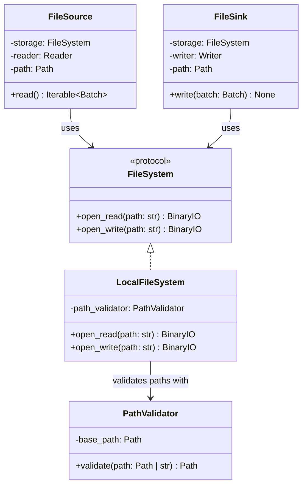

# LocalFileSystem Class Diagram

## Purpose

`LocalFileSystem` is a storage component responsible for low-level I/O against the local filesystem.

It implements the `FileSystem` protocol, providing readable and writable binary streams to higher-level components such as `FileSource` and `FileSink`.

The storage layer is deliberately separated from file-format handling. `LocalFileSystem` does not know about CSV, Parquet, `Batch`, readers, writers, sources, sinks, or pipeline orchestration.

For local filesystem security, `LocalFileSystem` uses `PathValidator` to ensure that paths remain within the configured permitted directory.

## Class Diagram



## Responsibilities

### FileSystem

`FileSystem` defines the minimal storage contract required by file sources and sinks.

It is responsible for providing access to file-like resources through binary streams.

`FileSystem` is **not** responsible for:

* Parsing or serializing file formats.
* Creating or interpreting `Batch` objects.
* Path-format-specific behavior.
* Source or sink orchestration.
* Pipeline execution.
* Application-level logging.

The protocol is intentionally small so that different storage implementations can provide the same operations.

### LocalFileSystem

`LocalFileSystem` is responsible for:

* Opening local files for reading.
* Opening local files for writing.
* Returning binary streams to callers.
* Applying local filesystem path validation through `PathValidator`.
* Propagating underlying filesystem errors.

`LocalFileSystem` is **not** responsible for:

* Parsing CSV, Parquet, or other formats.
* Serializing `Batch` objects.
* Selecting readers or writers.
* Source or sink orchestration.
* Pipeline execution.
* Application-level logging.

`LocalFileSystem` does not determine whether a path is valid from an application or authorization perspective. Its local path boundary is enforced through `PathValidator`.

### PathValidator

`PathValidator` is responsible for establishing whether a local path resolves within the configured filesystem boundary.

It does not check whether the path exists.

This allows the same validation operation to support both:

```text
FileSource → existing input path
FileSink   → existing or new output path
```

Filesystem existence and I/O behavior remain the responsibility of `LocalFileSystem`.

## Dependency Relationship

```text
FileSource ──┐
             ├──> FileSystem
FileSink ────┘
```

The concrete local implementation is supplied through the protocol:

```text
FileSystem
    │
    └── LocalFileSystem
             │
             └── PathValidator
```

`FileSource` and `FileSink` do not depend directly on `LocalFileSystem`.

This allows the same file source or sink to work with other storage implementations without changing its implementation:

```text
FileSystem
├── LocalFileSystem
├── S3Storage
└── HdfsStorage
```

## Data Flow

### FileSource

```text
FileSource
    │
    ├── FileSystem.open_read()
    │         │
    │         ▼
    │      BinaryIO
    │         │
    │         ▼
    └── Reader.read()
              │
              ▼
            Batch
```

The storage layer provides the resource. The reader interprets its contents.

### FileSink

```text
Batch
   │
   ▼
FileSink
   │
   ├── Writer.write()
   │         │
   │         ▼
   │      BinaryIO
   │
   └── FileSystem.open_write()
              │
              ▼
          filesystem
```

The writer serializes the batch into the supplied stream. The storage layer determines where that stream is ultimately stored.

## Interface

### FileSystem

```python
from typing import BinaryIO


class FileSystem(Protocol):
    def open_read(self, path: str) -> BinaryIO:
        ...

    def open_write(self, path: str) -> BinaryIO:
        ...
```

### LocalFileSystem

```python
from typing import BinaryIO


class LocalFileSystem:
    def __init__(self, path_validator: PathValidator) -> None:
        ...

    def open_read(self, path: str) -> BinaryIO:
        ...

    def open_write(self, path: str) -> BinaryIO:
        ...
```

## Contract

| Operation                          | Expected behavior                                       |
| ---------------------------------- | ------------------------------------------------------- |
| `open_read(path)`                  | Validates the path and returns a readable binary stream |
| `open_write(path)`                 | Validates the path and returns a writable binary stream |
| Read nonexistent path              | Raises the underlying filesystem error                  |
| Write to a valid new path          | Opens the destination for writing                       |
| Access path outside permitted base | Raises `PathValidationError`                            |
| Storage I/O failure                | Propagates the underlying filesystem error              |

`LocalFileSystem` does not require a path to exist before validation. Whether a read or write operation succeeds is determined by the corresponding filesystem operation.

Parent directories are not implicitly created by `LocalFileSystem` unless a future requirement explicitly introduces that behavior.

## SOLID Considerations

### Single Responsibility Principle

`LocalFileSystem` has one reason to change: the behavior of local filesystem I/O.

It does not combine filesystem access with path validation rules, serialization, or pipeline logic. Path containment remains encapsulated by `PathValidator`.

### Open/Closed Principle

`FileSource` and `FileSink` are open to additional storage implementations through the `FileSystem` protocol without requiring modification.

For example:

```text
FileSystem
├── LocalFileSystem
├── S3Storage
└── HdfsStorage
```

Adding another storage implementation does not require changes to the file source or sink.

No storage factory, registry, or plugin mechanism is required at this stage.

### Liskov Substitution Principle

Any storage implementation satisfying the `FileSystem` contract can be supplied to a `FileSource` or `FileSink`.

For example:

```python
FileSource(
    storage=LocalFileSystem(...),
    reader=CsvReader(),
    ...
)
```

and a future:

```python
FileSource(
    storage=S3Storage(...),
    reader=CsvReader(),
    ...
)
```

should satisfy the same source dependency.

### Interface Segregation Principle

`FileSystem` exposes only the operations required by file sources and sinks:

* Opening a resource for reading.
* Opening a resource for writing.

It does not expose unrelated filesystem administration operations such as directory traversal, permissions management, metadata management, or deletion.

### Dependency Inversion Principle

`FileSource` and `FileSink` depend on the `FileSystem` protocol rather than on `LocalFileSystem`.

`LocalFileSystem` depends on the lower-level `PathValidator` for local path containment.

This produces the following dependency direction:

```text
FileSource / FileSink
        │
        ▼
   FileSystem
        ▲
        │
LocalFileSystem
        │
        ▼
PathValidator
```

## Design Constraints

The storage abstraction should operate on binary streams rather than `bytes`.

```text
LocalFileSystem
       │
       │ BinaryIO
       ▼
   file resource
```

This avoids requiring the complete file contents to be loaded into memory before a reader or writer can process them.

It also allows the same file-format implementation to work across storage backends:

```text
LocalFileSystem ──┐
S3Storage ────────┼──> BinaryIO ──> CsvReader
HdfsStorage ──────┘
```

and:

```text
CsvWriter ──> BinaryIO ──> LocalFileSystem
                         └─> S3Storage
                         └─> HdfsStorage
```

`LocalFileSystem` should use Python's standard filesystem APIs and `pathlib.Path` internally.

`PathValidator` should remain responsible for local path containment. `LocalFileSystem` should not duplicate that security logic.

No additional abstractions such as storage factories, storage registries, remote filesystem base classes, or generic resource managers are required for the initial implementation.
