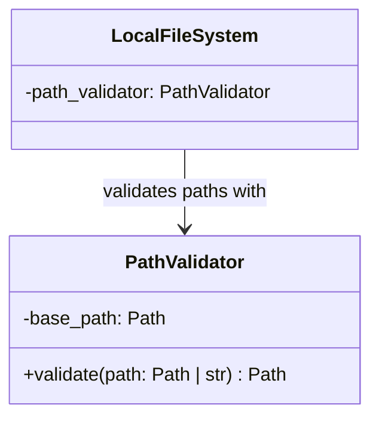

# PathValidator

## Purpose

`PathValidator` is a security component responsible for ensuring that a filesystem path resolves within an explicitly permitted base directory.

It resolves candidate paths before checking containment, preventing relative path traversal and symlink-based paths from escaping the permitted boundary.

`PathValidator` is intentionally small and independent of ETLRelay's storage, source, sink, reader, and writer implementations. `LocalFileSystem` uses it to validate local filesystem paths before performing I/O.

Path validation does not require the candidate to exist. Filesystem existence and access errors are handled by the storage component.

## Class Diagram



## Responsibilities

### PathValidator

`PathValidator` is responsible for:

* Accepting an optional base directory during construction.
* Defaulting the base directory to the current working directory when none is provided.
* Resolving the base directory and candidate paths.
* Determining whether a resolved candidate remains within the permitted base directory.
* Returning the resolved path when valid.
* Raising `PathValidationError` when a candidate escapes the permitted boundary.

`PathValidator` is **not** responsible for:

* Checking whether a candidate path exists.
* Opening, reading, or writing files.
* Creating directories.
* Parsing CSV or other data formats.
* Knowing about `Batch`.
* Knowing about `Source`, `Sink`, or pipeline execution.
* Performing authorization or user-level access control.
* Logging application-level events.

## Dependency Relationship

```text
LocalFileSystem
       │
       ▼
PathValidator
```

`LocalFileSystem` depends on `PathValidator` to enforce local path containment before performing filesystem operations.

`PathValidator` does not depend on `LocalFileSystem` or any higher-level ETLRelay component. It uses Python's `pathlib.Path` for path resolution and containment checks.

`FileSource` and `FileSink` depend on the `FileSystem` protocol rather than on `PathValidator` directly. Path validation is handled by the concrete local storage implementation.

## Interface

```python
from pathlib import Path


class PathValidator:
    def __init__(self, base_path: Path | None = None) -> None:
        ...

    def validate(self, path: Path | str) -> Path:
        ...


class PathValidationError(Exception):
    """Raised when a filesystem path fails validation."""
```

## Contract

| Operation                                                             | Expected behavior                                              |
| --------------------------------------------------------------------- | -------------------------------------------------------------- |
| Construct without a base path                                         | Uses the resolved current working directory                    |
| Construct with an explicit base path                                  | Uses the resolved supplied directory as the permitted boundary |
| Validate a contained relative path                                    | Returns the resolved path                                      |
| Validate a contained absolute path                                    | Returns the resolved path                                      |
| Validate the base directory itself                                    | Returns the resolved base path                                 |
| Validate a path containing safe `.` or `..` segments                  | Returns the resolved path if it remains within the boundary    |
| Validate a path containing traversal that escapes the base            | Raises `PathValidationError`                                   |
| Validate an absolute path outside the base                            | Raises `PathValidationError`                                   |
| Validate a path with a similar directory-name prefix outside the base | Raises `PathValidationError`                                   |
| Validate a symlink resolving inside the base                          | Returns the resolved target path                               |
| Validate a symlink resolving outside the base                         | Raises `PathValidationError`                                   |
| Validate a nonexistent path inside the base                           | Returns the resolved path; existence is not checked            |

## SOLID Considerations

### Single Responsibility Principle

`PathValidator` has one reason to change: the rules governing local filesystem path containment.

It does not combine path validation with filesystem I/O, data-format handling, or application logic.

### Open/Closed Principle

The implementation remains deliberately small. Additional path policies should be introduced only when concrete requirements justify them.

No path-policy hierarchy or configurable validation framework is required.

### Liskov Substitution Principle

No inheritance hierarchy is required. `PathValidator` is a concrete security utility whose behavior is defined by its contract.

### Interface Segregation Principle

No protocol is necessary for the current implementation. `PathValidator` exposes only the operation its consumer requires: `validate()`.

### Dependency Inversion Principle

`LocalFileSystem` delegates path-containment checks to `PathValidator` rather than implementing its own validation logic.

`PathValidator` depends only on Python's standard path-handling functionality and remains independent of higher-level ETLRelay components.

## Design Constraints

The implementation should use `pathlib.Path` and explicit path containment rather than string-prefix comparisons.

The validator establishes its permitted boundary during construction:

```text
PathValidator(base_path)
        │
        ▼
  trusted boundary
        │
        ▼
validate(candidate_path)
        │
        ├── contained ──> resolved Path
        │
        └── outside ────> PathValidationError
```

The containment check must occur after path resolution so that traversal segments and symlinks are evaluated against their resolved locations.

Path existence is deliberately outside this component's contract:

```text
PathValidator
      │
      ├── contained path ──> resolved Path
      │
      └── escaping path ───> reject

LocalFileSystem
      │
      ├── open existing resource for reading
      │
      └── open destination for writing
```

`PathValidator` establishes a path-containment boundary; it is not a complete filesystem sandbox or authorization mechanism. Filesystem changes between validation and subsequent use can still create time-of-check-to-time-of-use risks.

No additional abstractions such as `PathPolicy`, `PathResolver`, or a filesystem interface are required for this component.
