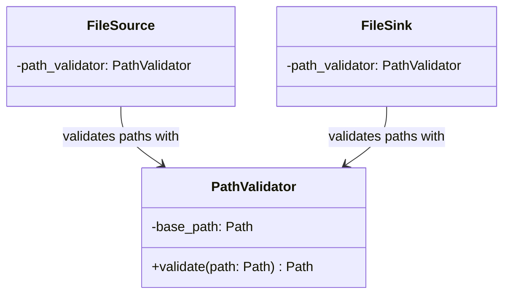

# PathValidator Class Diagram

## Purpose

`PathValidator` is a security component responsible for ensuring that a filesystem path remains within an explicitly permitted base directory.

It is intentionally small and independent of FlowForge's source, sink, reader, and writer implementations.

## Class Diagram



## Responsibilities

### PathValidator

`PathValidator` is responsible for:

* Accepting a trusted base directory during construction.
* Resolving candidate paths.
* Determining whether a candidate path is contained within the permitted base directory.
* Returning the resolved path when valid.
* Rejecting paths that escape the permitted directory.

`PathValidator` is **not** responsible for:

* Reading or writing files.
* Creating directories.
* Parsing CSV or other formats.
* Knowing about `Batch`.
* Knowing about `Source` or `Sink` behavior.
* Performing authorization or user-level access control.
* Logging application-level events.

## Dependency Relationship

```text
FileSource ──┐
             ├──> PathValidator
FileSink ────┘
```

`PathValidator` does not depend on either `FileSource` or `FileSink`.

This keeps the dependency direction toward the lower-level security component and prevents the security implementation from becoming coupled to particular source or sink implementations.

## Interface

```python
from pathlib import Path


class PathValidator:
    def __init__(self, base_path: Path) -> None:
        ...

    def validate(self, path: Path) -> Path:
        ...
```

### Contract

| Operation                                           | Expected behavior                             |
| --------------------------------------------------- | --------------------------------------------- |
| Construct with base path                            | Establishes the permitted filesystem boundary |
| Validate contained path                             | Returns the resolved path                     |
| Validate nested path                                | Returns the resolved path                     |
| Validate base directory itself                      | Returns the resolved base path                |
| Validate path containing `..` that escapes the base | Raises an exception                           |
| Validate absolute path outside the base             | Raises an exception                           |

## SOLID Considerations

### Single Responsibility Principle

`PathValidator` has one reason to change: the rules governing filesystem path containment.

It does not combine path validation with filesystem I/O or application logic.

### Open/Closed Principle

The initial implementation should remain closed to unnecessary extension. If FlowForge later requires additional path policies, those should be introduced in response to an actual requirement rather than anticipated through speculative abstractions.

### Liskov Substitution Principle

No inheritance hierarchy is required. `PathValidator` is a concrete security utility whose behavior is defined by its contract.

### Interface Segregation Principle

No interface or protocol is necessary at this stage. The validator exposes only the operation its consumers require: `validate()`.

### Dependency Inversion Principle

`FileSource` and `FileSink` depend on the path-validation abstraction of their responsibility rather than implementing path-containment logic themselves.

The validator itself depends only on Python's `pathlib.Path`, keeping the security component independent of higher-level FlowForge components.

## Design Constraints

The initial implementation should use `pathlib.Path` and explicit path containment rather than string-prefix comparisons.

The validator should establish its trusted base directory when constructed:

```text
PathValidator(base_path)
        │
        ▼
  trusted boundary
        │
        ▼
validate(candidate_path)
        │
        ├── contained ──> resolved Path
        │
        └── outside ────> reject
```

No additional abstractions such as `PathPolicy`, `PathResolver`, or a filesystem interface are required for this component unless future requirements justify them.
