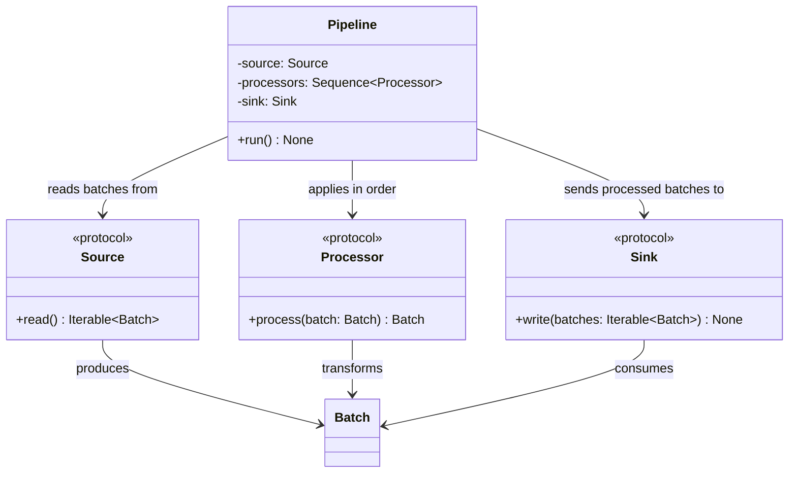

# Pipeline

## Purpose

`Pipeline` is the orchestration component responsible for executing a sequence of data processing steps.

It coordinates three components:

* `Source`, which produces an iterable of `Batch` objects.
* `Processor`, which transforms individual batches.
* `Sink`, which consumes an iterable of processed batches.

`Pipeline` controls the execution order but does not implement data extraction, transformation, or storage itself. It depends on the component protocols rather than concrete implementations.

Execution is synchronous and batch-oriented. The pipeline applies each configured processor to every batch in source order, then passes the resulting iterable to the sink.

## Class Diagram



## Responsibilities

### Pipeline

`Pipeline` is responsible for:

* Obtaining batches from the configured source.
* Applying processors to each batch in the configured order.
* Passing the processed batches to the configured sink.
* Supporting zero or more processors.
* Preserving source batch order.
* Propagating exceptions from source, processor, and sink operations.
* Coordinating execution without requiring all batches to be held in memory simultaneously.

`Pipeline` is **not** responsible for:

* Implementing source or sink behavior.
* Implementing individual data transformations.
* Parsing or serializing file formats.
* Managing filesystem access.
* Loading or validating YAML configuration.
* Implementing retries, scheduling, parallel execution, or distributed processing.
* Providing application-level logging infrastructure.

### Source

`Source` defines the contract for producing batches:

```python
read() -> Iterable[Batch]
```

Concrete sources, such as `FileSource`, are responsible for obtaining and producing batches from their respective data sources.

The pipeline consumes the iterable in the order supplied by the source.

### Processor

`Processor` defines the transformation contract:

```python
process(batch: Batch) -> Batch
```

Each processor receives one batch and returns the batch to be passed to the next processor.

The pipeline determines the order in which processors execute. Processors do not need to know about the pipeline or other processors.

For each source batch, the processors execute sequentially:

```text
Batch
  ↓
Processor 1
  ↓
Processor 2
  ↓
Processor N
  ↓
Processed Batch
```

If there are no processors, the original batch passes through unchanged.

### Sink

`Sink` defines the contract for consuming processed batches:

```python
write(batches: Iterable[Batch]) -> None
```

Concrete sinks are responsible for delivering the iterable to their destinations.

For example, `FileSink` opens its configured destination and passes the iterable to a writer, which serializes the batches into a single output resource.

The pipeline calls `Sink.write()` once per successful invocation of `Pipeline.run()`. The sink is responsible for consuming the iterable during that call.

An empty source iterable is valid. In that case, the sink receives an empty iterable.

## Dependency Relationship

```text
Pipeline
   │
   ├── Source
   │     └── produces Iterable[Batch]
   │
   ├── Sequence[Processor]
   │     └── transforms each Batch in order
   │
   └── Sink
         └── consumes Iterable[Batch]
```

`Pipeline` depends only on the `Source`, `Processor`, and `Sink` protocols.

It does not depend directly on `FileSource`, `FileSink`, `CsvReader`, `CsvWriter`, or any particular storage implementation.

This allows different combinations of sources, processors, and sinks to be composed without changing the pipeline implementation.

## Data Flow

The pipeline executes the following logical flow:

```text
Source.read()
      │
      ▼
Iterable[Batch]
      │
      ▼
Apply processors to each batch
      │
      ▼
Iterable[Processed Batch]
      │
      ▼
Sink.write(batches)
```

For an individual batch, processing occurs in configured order:

```text
Source Batch
      │
      ▼
Processor 1
      │
      ▼
Processor 2
      │
      ▼
     ...
      │
      ▼
Processed Batch
```

The resulting batches preserve source order.

The pipeline should process batches incrementally rather than unnecessarily collecting the entire iterable into memory. A lazy iterable or generator can apply the processors as the sink consumes batches.

Because execution is synchronous, processing and sink consumption take place during the `Pipeline.run()` call.

## Interface

```python
from collections.abc import Sequence

from etlrelay.core.processor import Processor
from etlrelay.core.sink import Sink
from etlrelay.core.source import Source


class Pipeline:
    def __init__(
        self,
        source: Source,
        processors: Sequence[Processor],
        sink: Sink,
    ) -> None:
        ...

    def run(self) -> None:
        ...
```

## Contract

| Operation or scenario                | Expected behavior                                    |
| ------------------------------------ | ---------------------------------------------------- |
| Run with one batch                   | Processes and delivers the batch to the sink         |
| Run with multiple batches            | Processes batches in source order                    |
| Multiple processors                  | Applies processors in configured order to each batch |
| No processors                        | Passes source batches through unchanged              |
| Sink invocation                      | Calls `Sink.write()` once per run                    |
| Empty source iterable                | Passes an empty iterable to the sink                 |
| Source raises an exception           | Propagates the exception                             |
| Source iteration raises an exception | Propagates the exception during execution            |
| Processor raises an exception        | Propagates the exception and stops normal execution  |
| Sink raises an exception             | Propagates the exception                             |
| Run completes successfully           | Returns `None`                                       |

The pipeline does not introduce a separate exception hierarchy or silently discard failed batches.

Exceptions arising while the sink consumes the processed iterable propagate through `Pipeline.run()` when consumption occurs synchronously.

## SOLID Considerations

### Single Responsibility Principle

`Pipeline` has one primary responsibility: coordinating the execution order of source, processors, and sink.

Data extraction, transformation logic, and output handling remain in their respective components.

### Open/Closed Principle

New source, processor, and sink implementations can be introduced without modifying `Pipeline`, provided they satisfy their respective protocols.

For example, a future SQL source or Parquet writer can participate in the same pipeline execution model.

### Liskov Substitution Principle

Any implementation satisfying a required protocol can be supplied to `Pipeline`, provided it preserves the protocol's behavioral contract.

The pipeline does not need special handling for particular concrete implementations.

### Interface Segregation Principle

`Pipeline` depends on three small protocols, each representing one role:

* `Source` produces batches.
* `Processor` transforms a batch.
* `Sink` consumes batches.

No component must implement unrelated pipeline orchestration behavior.

### Dependency Inversion Principle

`Pipeline` depends on protocols rather than concrete source, processor, and sink classes.

This keeps the orchestration logic independent of storage technologies, file formats, and individual transformations.

## Design Constraints

The implementation should remain synchronous and batch-oriented.

* Preserve the source's batch order.
* Apply processors sequentially to each batch.
* Support an empty processor sequence.
* Pass processed batches to the sink as an iterable.
* Invoke the sink once per run.
* Allow incremental processing without unnecessarily buffering all batches.
* Propagate exceptions.
* Avoid retries, scheduling, parallelism, cancellation frameworks, and execution-result models unless concrete requirements justify them.

The central design principle is:

**`Pipeline` determines the execution order; sources obtain data, processors transform individual batches, and sinks consume the resulting iterable.**
