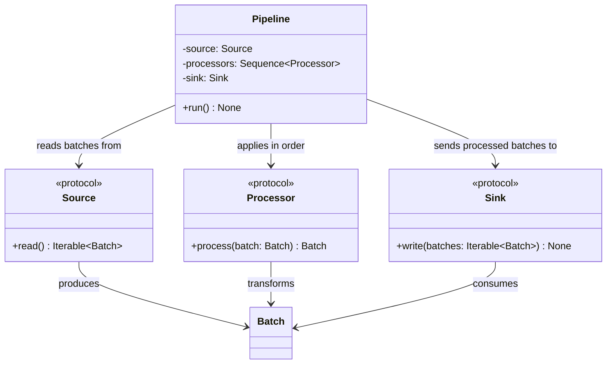

# Pipeline

## Purpose

`Pipeline` is the orchestration component responsible for executing a sequence of data processing steps.

It coordinates three components:

* `Source`, which produces an iterable of `Batch` objects.
* `Processor`, which transforms individual batches.
* `Sink`, which consumes the processed batches.

`Pipeline` controls the execution order but does not implement data extraction, transformation, or storage itself. It depends on the component protocols rather than concrete implementations.

## Class Diagram



## Responsibilities

### Pipeline

`Pipeline` is responsible for:

* Obtaining batches from the configured source.
* Applying processors to each batch in the configured order.
* Passing the processed batches to the configured sink.
* Handling pipelines with zero or more processors.
* Allowing exceptions from source, processor, or sink operations to propagate.

`Pipeline` is **not** responsible for:

* Implementing source or sink behavior.
* Implementing individual data transformations.
* Parsing or serializing file formats.
* Managing filesystem access.
* Loading or validating YAML configuration.
* Implementing retries, scheduling, parallel execution, or distributed processing.
* Providing application-level logging infrastructure.

### Source

`Source` defines the contract for producing batches:

```python
read() -> Iterable[Batch]
```

Concrete sources, such as `FileSource`, are responsible for obtaining and producing batches from their respective data sources.

### Processor

`Processor` defines the transformation contract:

```python
process(batch: Batch) -> Batch
```

Each processor receives one batch and returns the batch to be passed to the next processor.

The pipeline determines the order in which processors execute. The processors themselves do not need to know about the pipeline or other processors.

### Sink

`Sink` defines the contract for consuming processed batches:

```python
write(batches: Iterable[Batch]) -> None
```

Concrete sinks are responsible for delivering batches to their destinations.

For example, `FileSink` passes the iterable to a writer, which serializes the batches into a single output resource.

## Dependency Relationship

```text
Pipeline
   │
   ├── Source
   │     └── produces Iterable[Batch]
   │
   ├── Sequence[Processor]
   │     └── transforms each Batch in order
   │
   └── Sink
         └── consumes Iterable[Batch]
```

`Pipeline` depends only on the `Source`, `Processor`, and `Sink` protocols.

It does not depend directly on `FileSource`, `FileSink`, `CsvReader`, `CsvWriter`, or any particular storage implementation.

This allows different combinations of sources, processors, and sinks to be composed without changing the pipeline implementation.

## Data Flow

The pipeline executes the following logical flow:

```text
Source.read()
      │
      ▼
Iterable[Batch]
      │
      ▼
Processor 1
      │
      ▼
Processor 2
      │
      ▼
     ...
      │
      ▼
Iterable[Batch]
      │
      ▼
Sink.write()
```

Each batch passes through all configured processors in sequence before being delivered to the sink.

With no processors, batches pass from the source to the sink unchanged.

The pipeline should process batches incrementally where possible rather than collecting the entire iterable into memory. The sink consumes the resulting iterable during the synchronous `run()` operation.

## Interface

```python
from collections.abc import Sequence

from flowforge.core.processor import Processor
from flowforge.core.sink import Sink
from flowforge.core.source import Source


class Pipeline:
    def __init__(
        self,
        source: Source,
        processors: Sequence[Processor],
        sink: Sink,
    ) -> None:
        ...

    def run(self) -> None:
        ...
```

## Contract

| Operation or scenario         | Expected behavior                                            |
| ----------------------------- | ------------------------------------------------------------ |
| Run with one batch            | Processes and delivers the batch to the sink                 |
| Run with multiple batches     | Processes batches in source order                            |
| Multiple processors           | Applies processors in configured order to each batch         |
| No processors                 | Passes source batches through unchanged                      |
| Source raises an exception    | Propagates the exception                                     |
| Processor raises an exception | Propagates the exception and stops normal pipeline execution |
| Sink raises an exception      | Propagates the exception                                     |
| Empty source iterable         | Completes without processing any batches                     |
| Run completes                 | Returns `None`                                               |

The pipeline does not introduce a separate exception hierarchy or silently discard failed batches.

## SOLID Considerations

### Single Responsibility Principle

`Pipeline` has one primary responsibility: coordinating the execution order of source, processors, and sink.

Data extraction, transformation logic, and output handling remain in their respective components.

### Open/Closed Principle

New source, processor, and sink implementations can be introduced without modifying `Pipeline`, provided they satisfy their respective protocols.

For example, a future SQL source or Parquet writer can participate in the same pipeline execution model.

### Liskov Substitution Principle

Any implementation satisfying a required protocol can be supplied to `Pipeline`, provided it preserves the protocol's behavioral contract.

The pipeline does not need special handling for particular concrete implementations.

### Interface Segregation Principle

`Pipeline` depends on three small protocols, each representing one role:

* `Source` produces batches.
* `Processor` transforms a batch.
* `Sink` consumes batches.

No component must implement unrelated pipeline orchestration behavior.

### Dependency Inversion Principle

`Pipeline` depends on protocols rather than concrete source, processor, and sink classes.

This keeps the orchestration logic independent of storage technologies, file formats, and individual transformations.

## Design Constraints

The initial implementation should remain synchronous and batch-oriented.

* Preserve the source's batch order.
* Apply processors sequentially to each batch.
* Support an empty processor sequence.
* Pass processed batches to the sink as an iterable.
* Propagate exceptions.
* Avoid buffering all batches unnecessarily.
* Avoid retries, scheduling, parallelism, cancellation frameworks, and execution-result models unless concrete requirements justify them.

The central design principle is:

**`Pipeline` determines the execution order; sources obtain data, processors transform it, and sinks consume the results.**
