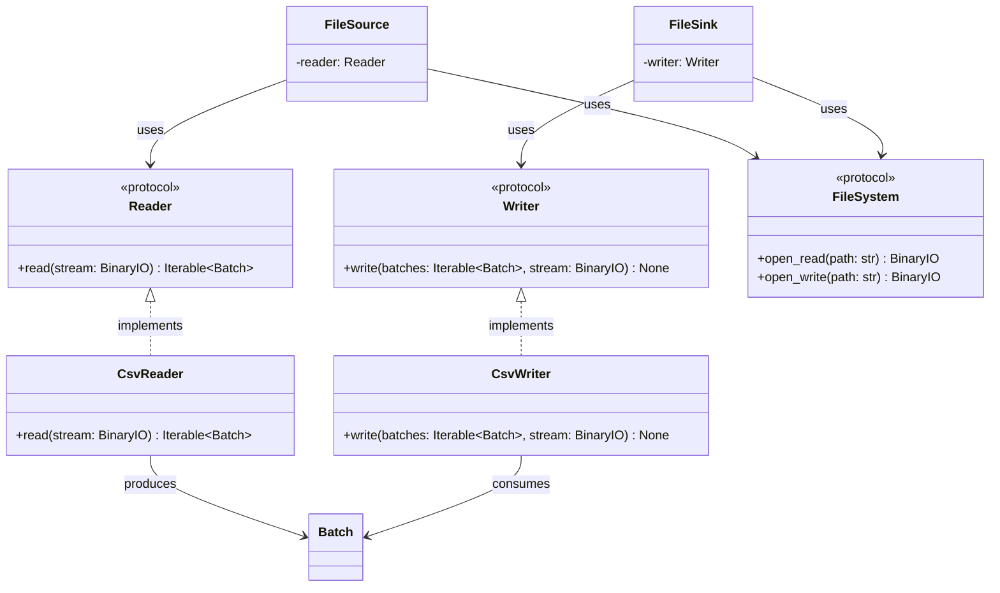

# Reader and Writer

## Purpose

`Reader` and `Writer` define small protocols for converting between serialized data and ETLRelay's common `Batch` representation.

A `Reader` consumes a binary stream and produces an iterable of `Batch` objects.

A `Writer` consumes an iterable of `Batch` objects and serializes them to a binary stream.

The protocols separate format-specific parsing and serialization from storage access. Higher-level components such as `FileSource` and `FileSink` compose these protocols with a `FileSystem` implementation.

The current concrete implementations are `CsvReader` and `CsvWriter`.

## Class Diagram



## Responsibilities

### Reader

`Reader` defines the contract for converting serialized data from a binary stream into ETLRelay batches.

It is responsible only for defining the reading operation and its return contract.

`Reader` is **not** responsible for:

* Opening filesystem resources.
* Selecting storage backends or resource paths.
* Validating local filesystem path containment.
* Writing serialized data.
* Transforming batches as part of pipeline processing.
* Orchestrating pipelines.

### Writer

`Writer` defines the contract for serializing ETLRelay batches to a binary stream.

It is responsible only for defining the writing operation and its input contract.

`Writer` is **not** responsible for:

* Opening filesystem resources.
* Selecting storage backends or destination paths.
* Validating local filesystem path containment.
* Reading serialized data.
* Applying pipeline transformations.
* Orchestrating pipelines.

### CsvReader

`CsvReader` implements `Reader` for CSV data.

It is responsible for:

* Parsing CSV data from a supplied binary stream.
* Converting parsed data into ETLRelay `Batch` objects.
* Returning the resulting batches through an iterable.

It is **not** responsible for:

* Opening or locating files.
* Validating filesystem paths.
* Writing CSV data.
* Applying pipeline transformations.
* Managing pipeline execution.

The underlying parsing implementation uses PyArrow.

### CsvWriter

`CsvWriter` implements `Writer` for CSV data.

It is responsible for:

* Accepting an iterable of `Batch` objects.
* Serializing the batches as CSV data.
* Writing the serialized output to the supplied binary stream.

It is **not** responsible for:

* Opening or locating the destination.
* Validating filesystem paths.
* Reading CSV data.
* Applying pipeline transformations.
* Managing pipeline execution.

The underlying serialization implementation uses PyArrow.

## Dependency Relationship

```text
FileSource ──> Reader
                  ▲
                  │
              CsvReader

FileSink ───> Writer
                  ▲
                  │
              CsvWriter
```

`FileSource` depends on the `Reader` protocol rather than directly on `CsvReader`.

`FileSink` depends on the `Writer` protocol rather than directly on `CsvWriter`.

Storage access is a separate dependency:

```text
FileSource ──> FileSystem
FileSink   ──> FileSystem
```

The `FileSystem` implementation opens the resource and provides a binary stream. The reader or writer then operates on that stream without needing to know where the data is stored.

This separation allows different storage implementations and format implementations to be combined without modifying the source or sink orchestration.

For example:

```python
FileSource(
    path="input.csv",
    storage=LocalFileSystem(...),
    reader=CsvReader(),
)
```

A future reader for another format could be supplied without changing `FileSource`, provided it satisfies the `Reader` protocol.

## Interfaces

### Reader

```python
from collections.abc import Iterable
from typing import BinaryIO, Protocol

from etlrelay.core import Batch


class Reader(Protocol):
    def read(self, stream: BinaryIO) -> Iterable[Batch]:
        ...
```

### Writer

```python
from collections.abc import Iterable
from typing import BinaryIO, Protocol

from etlrelay.core import Batch


class Writer(Protocol):
    def write(
        self,
        batches: Iterable[Batch],
        stream: BinaryIO,
    ) -> None:
        ...
```

### CsvReader

```python
class CsvReader:
    def read(self, stream: BinaryIO) -> Iterable[Batch]:
        ...
```

### CsvWriter

```python
class CsvWriter:
    def write(
        self,
        batches: Iterable[Batch],
        stream: BinaryIO,
    ) -> None:
        ...
```

## Contract

### Reader

| Operation                   | Expected behavior                                 |
| --------------------------- | ------------------------------------------------- |
| Read valid CSV data         | Returns an iterable of `Batch` objects            |
| Read malformed CSV data     | Raises an appropriate parsing exception           |
| Read from a supplied stream | Parses the supplied stream without opening a path |
| Implement another format    | Can provide another implementation of `Reader`    |

### Writer

| Operation                    | Expected behavior                                                 |
| ---------------------------- | ----------------------------------------------------------------- |
| Write an iterable of batches | Serializes the supplied batches to the stream                     |
| Write multiple batches       | Preserves batch order and serializes their data                   |
| Write an empty batch         | Handles it according to the writer's defined empty-batch behavior |
| Write an empty iterable      | Handles the absence of batches according to the writer's contract |
| Implement another format     | Can provide another implementation of `Writer`                    |

Readers and writers do not validate filesystem paths. Storage access and local path containment are handled by the storage implementation and its security dependencies.

The writer receives the stream from its caller and does not close it. Stream ownership remains with the component that opened it, typically `FileSink` using a context manager.

## SOLID Considerations

### Single Responsibility Principle

Each component has one primary reason to change:

* `Reader` changes if the reading contract changes.
* `Writer` changes if the writing contract changes.
* `CsvReader` changes if CSV parsing behavior changes.
* `CsvWriter` changes if CSV serialization behavior changes.

Format-specific parsing and serialization remain separate from storage access and source/sink orchestration.

### Open/Closed Principle

New file formats can be introduced by implementing the existing protocols.

For example:

```text
Reader
├── CsvReader
└── ParquetReader (future)
```

```text
Writer
├── CsvWriter
└── ParquetWriter (future)
```

Adding another format does not require modifying the corresponding protocol or `FileSource`/`FileSink` implementation.

No format registry or plugin mechanism is required at this stage.

### Liskov Substitution Principle

Any implementation satisfying `Reader` can be supplied wherever a `Reader` is required.

Any implementation satisfying `Writer` can be supplied wherever a `Writer` is required.

Implementations must preserve the respective contracts, including stream handling, batch ordering, and exception propagation.

### Interface Segregation Principle

`Reader` and `Writer` are intentionally separate protocols.

A reader does not need to implement writing operations, and a writer does not need to implement reading operations.

Each protocol exposes only the operation its consumers require.

### Dependency Inversion Principle

`FileSource` depends on the `Reader` protocol rather than on `CsvReader`.

`FileSink` depends on the `Writer` protocol rather than on `CsvWriter`.

Both depend on the `FileSystem` protocol for resource access rather than requiring a specific storage implementation.

This keeps file-format handling independent of both storage technology and higher-level orchestration.

## Design Constraints

The initial implementation should remain deliberately small.

The protocols should:

* Accept binary streams rather than filesystem paths.
* Use `Batch` as the ETLRelay data boundary.
* Support iterables of batches.
* Define only `read()` for readers and `write()` for writers.
* Avoid format-specific methods in the protocols.
* Avoid generic type hierarchies unless a concrete requirement emerges.
* Avoid reader/writer factories and registries.
* Avoid filesystem access and path validation within readers and writers.
* Leave stream lifecycle management to the component that opens the stream.

The intended dependency flow is:

```text
FileSource
    │
    ├── FileSystem.open_read(path)
    │          │
    │          ▼
    │       BinaryIO
    │          │
    │          ▼
    └── Reader.read(stream)
               │
               ▼
         Iterable[Batch]
```

```text
FileSink
    │
    ├── FileSystem.open_write(path)
    │          │
    │          ▼
    │       BinaryIO
    │          ▲
    │          │
    └── Writer.write(batches, stream)
```

The protocols provide the substitution boundary between format-independent file sources/sinks and format-specific serialization implementations.

**The central design principle is that storage handles resource access, readers and writers handle serialization, and file sources and sinks compose those responsibilities.**
