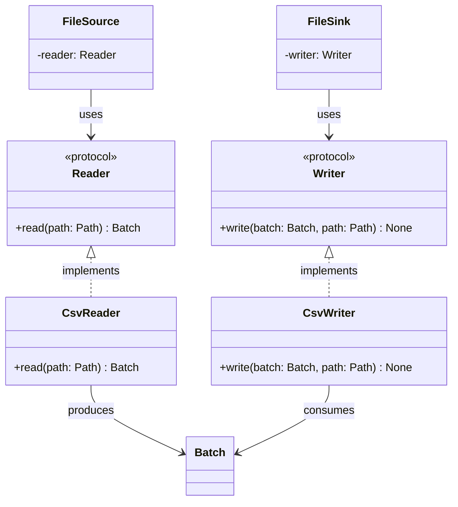

# Reader and Writer Class Diagram

## Purpose

`Reader` and `Writer` define small interfaces for converting between FlowForge's in-memory `Batch` representation and serialized data.

`Reader` implementations read a specific data format, such as CSV, and produce a `Batch`.

`Writer` implementations take a `Batch` and serialize it to a specific data format.

The protocols allow higher-level components such as `FileSource` and `FileSink` to depend on the required behavior rather than on a specific file format implementation.

The initial concrete implementations are `CsvReader` and `CsvWriter`.

## Class Diagram



## Responsibilities

### Reader

`Reader` defines the contract for converting a serialized file into a FlowForge `Batch`.

`Reader` is responsible only for defining the reading operation.

`Reader` is **not** responsible for:

* Selecting which file to read.
* Validating filesystem paths.
* Performing filesystem access policy checks.
* Writing files.
* Executing pipeline transformations.
* Orchestrating pipelines.

### Writer

`Writer` defines the contract for converting a FlowForge `Batch` into a serialized file.

`Writer` is responsible only for defining the writing operation.

`Writer` is **not** responsible for:

* Selecting which file to write.
* Validating filesystem paths.
* Executing pipeline transformations.
* Reading files.
* Orchestrating pipelines.

### CsvReader

`CsvReader` implements `Reader` for CSV data.

It is responsible for:

* Reading CSV data from a validated path.
* Converting the CSV data into a `Batch`.

It is **not** responsible for:

* Path validation.
* Deciding where the file is located.
* Pipeline orchestration.
* Processing or transforming the resulting `Batch`.

### CsvWriter

`CsvWriter` implements `Writer` for CSV data.

It is responsible for:

* Converting a `Batch` into CSV data.
* Writing the CSV data to the supplied path.

It is **not** responsible for:

* Path validation.
* Deciding where the output file should be located.
* Processing or transforming the `Batch`.
* Pipeline orchestration.

## Dependency Relationship

```text
FileSource ──> Reader
                  ▲
                  │
             CsvReader
             ExcelReader
                 ...

FileSink ───> Writer
                  ▲
                  │
             CsvWriter
             ExcelWriter
                 ...
```

`FileSource` depends on the `Reader` protocol rather than directly on `CsvReader`.

`FileSink` depends on the `Writer` protocol rather than directly on `CsvWriter`.

This allows the concrete format implementation to be selected by the composition of the application.

For example:

```python
FileSource(reader=CsvReader(...))
```

could later become:

```python
FileSource(reader=ExcelReader(...))
```

without changing the `FileSource` implementation.

## Interfaces

### Reader

```python
from pathlib import Path
from typing import Protocol


class Reader(Protocol):
    def read(self, path: Path) -> Batch:
        ...
```

### Writer

```python
from pathlib import Path
from typing import Protocol


class Writer(Protocol):
    def write(self, batch: Batch, path: Path) -> None:
        ...
```

### CsvReader

```python
class CsvReader:
    def read(self, path: Path) -> Batch:
        ...
```

### CsvWriter

```python
class CsvWriter:
    def write(self, batch: Batch, path: Path) -> None:
        ...
```

## Contract

### Reader

| Operation                | Expected behavior                           |
| ------------------------ | ------------------------------------------- |
| Read valid CSV file      | Returns a `Batch`                           |
| Read empty/invalid CSV   | Raises an appropriate exception             |
| Read from supplied path  | Reads only from the supplied path           |
| Implement another format | Can provide another `Reader` implementation |

### Writer

| Operation                | Expected behavior                           |
| ------------------------ | ------------------------------------------- |
| Write a `Batch`          | Serializes the batch to the supplied path   |
| Write to supplied path   | Writes only to the supplied path            |
| Implement another format | Can provide another `Writer` implementation |

Path validation is outside these contracts. The higher-level `FileSource` and `FileSink` components are responsible for validating paths before passing them to the reader or writer.

## SOLID Considerations

### Single Responsibility Principle

Each component has one primary reason to change:

* `Reader` changes if the reading contract changes.
* `Writer` changes if the writing contract changes.
* `CsvReader` changes if CSV reading behavior changes.
* `CsvWriter` changes if CSV writing behavior changes.

Format-specific parsing and serialization remain separate from source and sink orchestration.

### Open/Closed Principle

New file formats can be added by implementing the existing protocols.

For example:

```text
Reader
├── CsvReader
└── ExcelReader
```

Adding `ExcelReader` does not require modifying the `Reader` contract or `FileSource`.

The same applies to writers.

No format registry or plugin mechanism is required at this stage.

### Liskov Substitution Principle

Any implementation satisfying `Reader` can be supplied where a `Reader` is required.

Any implementation satisfying `Writer` can be supplied where a `Writer` is required.

For example:

```python
FileSource(reader=CsvReader())
```

and, when implemented:

```python
FileSource(reader=ExcelReader())
```

should both satisfy the same `FileSource` dependency.

### Interface Segregation Principle

`Reader` and `Writer` are intentionally separate protocols.

A reader does not need to implement writing operations, and a writer does not need to implement reading operations.

Each protocol exposes only the operation its consumers require.

### Dependency Inversion Principle

`FileSource` depends on the `Reader` protocol rather than on `CsvReader`.

`FileSink` depends on the `Writer` protocol rather than on `CsvWriter`.

This keeps higher-level source and sink behavior independent of specific serialization formats.

## Design Constraints

The initial implementation should remain deliberately small.

The protocols should:

* Use `pathlib.Path` for filesystem paths.
* Use `Batch` as the FlowForge data boundary.
* Define only `read()` for readers.
* Define only `write()` for writers.
* Avoid format-specific methods in the protocols.
* Avoid generic type hierarchies unless a concrete requirement emerges.
* Avoid reader/writer factories or registries.
* Avoid putting path validation into readers or writers.

The intended dependency direction is:

```text
PathValidator
      │
      ▼
FileSource ──> Reader ──> CsvReader
      │
      └──> LocalFileSystem


PathValidator
      │
      ▼
FileSink ──> Writer ──> CsvWriter
      │
      └──> LocalFileSystem
```

The protocols provide the substitution boundary between the format-independent source/sink components and format-specific serialization implementations.
