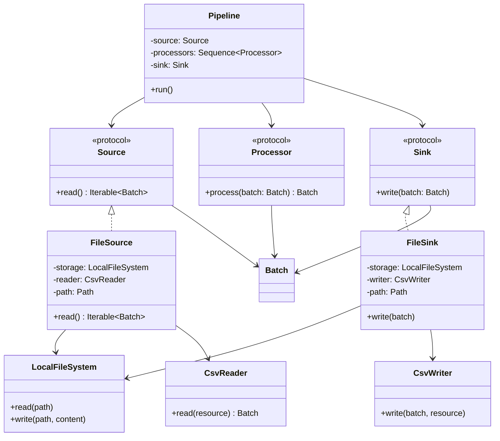

# Phase 1 Implementation Plan — Minimal Local CSV Pipeline

## Goal

Build the first useful vertical slice of FlowForge:

```text
Local CSV File
      ↓
  File Source
      ↓
  Processor(s)
      ↓
  File Sink
      ↓
Local CSV File
```

This phase exists to prove that the pipeline model works with real input and output.

Do not stop at abstract `Source` and `Sink` interfaces. A concrete local implementation must be available and exercised by integration and functional tests.

---

# Rules for This Phase

Keep the implementation deliberately small.

### Build

- batch representation;
- pipeline execution;
- local file source;
- local file sink;
- CSV reading;
- CSV writing;
- one simple processor;
- unit tests;
- integration tests;
- one functional test.

### Do Not Build

- S3;
- HDFS;
- SQL;
- YAML;
- CLI;
- scheduling;
- asynchronous execution;
- retries;
- parallelism;
- plugin framework;
- distributed execution.

### Design Rule

> Do not create an abstraction because a future component might need it. Create it because the current implementation or a current test requires it.

---

# Target Design

The smallest useful design is:

```text
                 Pipeline
                    │
          ┌─────────┼─────────┐
          │         │         │
       Source   Processor(s)  Sink
          │                   │
     FileSource            FileSink
          │                   │
     ┌────┴────┐          ┌───┴────┐
     │         │          │        │
 LocalFile  CsvReader  CsvWriter LocalFile
 System                 System
```

The exact class names may change during implementation. The responsibilities should not.

## Minimal SOLID Class Diagram



This is intentionally not a full storage/format abstraction. `LocalFileSystem`, `CsvReader`, and `CsvWriter` are concrete Phase 1 components. A generalized `StorageBackend` and broader reader/writer strategy are deferred until the local implementation gives us evidence that those boundaries are useful.

---

# Batch Model

## Requirement

The pipeline is batch-oriented.

A processor should operate on a complete batch rather than on individual records:

```text
batch → processor → batch
```

A source should be able to produce one or more batches:

```text
source → batch
       → batch
       → ...
```

A sink consumes processed batches.

## Initial Recommendation

Use Apache Arrow as the concrete batch representation if it can satisfy the Phase 1 tests without introducing unnecessary complexity.

For the first local CSV implementation, it is acceptable for one CSV file to produce one Arrow table/batch.

Do not implement chunking or streaming merely because the source contract could eventually support it.

## Acceptance Criteria

Tests establish that:

- a batch can represent tabular data;
- an empty batch is representable;
- a batch can pass unchanged through a processor;
- a processor can replace a batch with another batch;
- a batch can be supplied to a sink.

---

# TDD Workflow

Work on exactly one behavior at a time.

For each behavior:

```text
1. Read the requirement
       ↓
2. Write acceptance criteria
       ↓
3. Write one or more failing tests
       ↓
4. Run the smallest relevant test
       ↓
5. Implement the minimum code
       ↓
6. Run the test again
       ↓
7. Refactor only after green
       ↓
8. Run relevant integration/functional tests
       ↓
9. Run quality checks
       ↓
10. Commit
```

Do not start the next behavior while the current behavior is failing.

---

# Step 1 — Establish the Package

## Acceptance Criteria

The package can be imported by pytest.

Expected shape:

```text
src/
└── flowforge/
    └── __init__.py

tests/
```

## Tests

Create the smallest import test needed to prove packaging works.

## Verification

```bash
uv run pytest
```

Expected result:

```text
1 passed
```

## Commit

```bash
git add src tests
git commit -m "test: establish FlowForge package"
```

Only commit once the test and package import succeed.

---

# Step 2 — Define the Batch Contract

## Acceptance Criteria

The implementation has one clear batch type.

The batch:

- represents tabular data;
- can be passed to processors;
- can be passed to sinks;
- can be empty.

Do not add:

- metadata systems;
- lineage;
- partition objects;
- execution IDs;
- custom collection hierarchies.

## Unit Tests

Write tests for:

1. a batch containing rows/columns;
2. an empty batch;
3. passing a batch through unchanged.

Use the smallest possible fixtures.

## Quality Check

```bash
uv run pytest tests/unit
pyright
ruff check .
```

---

# Step 3 — Define the Processor Contract Through a Concrete Test

## Acceptance Criteria

A processor receives one batch and returns one batch.

```text
input batch
     ↓
 processor
     ↓
output batch
```

## Unit Test

Create a simple test processor that performs an obvious deterministic transformation.

Example:

```text
age: 30
age: 40

        ↓ +1

age: 31
age: 41
```

The purpose is to establish the behavior of:

```text
Batch → Batch
```

Do not create several processor subclasses yet.

A small protocol or interface is sufficient if the tests show that a reusable contract is useful.

---

# Step 4 — Define Pipeline Execution

## Acceptance Criteria

A pipeline:

- accepts a source;
- accepts zero or more processors;
- accepts a sink;
- processes batches in order;
- passes the final batch to the sink.

For zero processors:

```text
Source → Sink
```

For two processors:

```text
Source → Processor A → Processor B → Sink
```

## Unit Tests

Write tests for:

### Single batch

```text
source
  ↓
processor
  ↓
sink
```

Verify the sink receives the processed batch.

### Processor order

Use two processors with clearly distinguishable transformations.

Verify:

```text
Processor A
    ↓
Processor B
```

not the reverse.

### Zero processors

Verify the source batch reaches the sink unchanged.

### Multiple batches

The source returns:

```text
batch A
batch B
```

The sink should receive:

```text
processed batch A
processed batch B
```

in the same order.

---

# Step 5 — Define the Initial Failure Behavior

## Acceptance Criteria

Failures propagate to the caller.

No general error framework is required.

## Unit Tests

Add one test for each boundary:

```text
Source raises
    ↓
Pipeline.run raises

Processor raises
    ↓
Pipeline.run raises

Sink raises
    ↓
Pipeline.run raises
```

Verify that the original exception reaches the caller.

Do not introduce retries or recovery.

## Design Decision

At this stage, `Pipeline.run()` does not need a custom result object.

A successful execution can simply complete normally.

---

# Step 6 — Implement the Local Filesystem

## Acceptance Criteria

A minimal local filesystem component can:

- open/read a local file;
- create/write a local file;
- report normal filesystem errors.

Do not build a generalized remote storage API yet.

## TDD

Use temporary directories/files supplied by pytest.

Do not read or write files inside the repository during tests.

## Integration Test

Prove that a real local file can be written and read.

```text
pytest temp directory
      ↓
LocalFileSystem
      ↓
file
      ↓
LocalFileSystem
      ↓
content
```

---

# Step 7 — Implement CSV Reading

## Acceptance Criteria

A CSV reader can:

- read a CSV file/resource;
- interpret its header;
- produce the Phase 1 batch representation;
- handle multiple rows;
- produce an empty result for a valid CSV with no data rows;
- fail predictably for malformed input.

## Unit Tests

Test parsing independently where practical.

Use small inline CSV fixtures.

Example:

```text
name,age
Alice,30
Bob,40
```

Expected batch:

```text
name | age
-----|----
Alice| 30
Bob  | 40
```

The exact Arrow types should be determined by the implementation and documented once established.

---

# Step 8 — Implement the Local File Source

## Acceptance Criteria

`FileSource` combines the local storage behavior and CSV reading behavior.

The source can be given:

```text
path → CSV → batch
```

A missing file fails predictably.

## Integration Test

Use:

```text
real temporary CSV
       ↓
FileSource
       ↓
real batch
```

Do not mock the filesystem in this test.

This test validates the actual source users will rely on.

---

# Step 9 — Implement CSV Writing

## Acceptance Criteria

A CSV writer can:

- accept the batch representation;
- create valid CSV;
- write headers;
- write rows;
- handle an empty batch consistently.

## Unit Tests

Test serialization independently where practical.

Verify exact expected CSV content for a small deterministic table.

---

# Step 10 — Implement the Local File Sink

## Acceptance Criteria

`FileSink` combines local storage and CSV writing behavior.

The sink can:

```text
batch
  ↓
CSV
  ↓
local file
```

## Integration Test

Write a real output file into a pytest temporary directory.

Read the resulting file back and verify its contents.

---

# Step 11 — Build the First Functional Pipeline

This is the key proof of Phase 1.

## Acceptance Criteria

A complete pipeline performs:

```text
input.csv
   ↓
FileSource
   ↓
Processor
   ↓
FileSink
   ↓
output.csv
```

The processor must change the data.

## Functional Test

Use a small, readable fixture.

Example input:

```csv
name,age
Alice,30
Bob,40
```

Processor behavior:

```text
age + 1
```

Expected output:

```csv
name,age
Alice,31
Bob,41
```

This test should use the actual production components:

- real `FileSource`;
- real CSV reader;
- real pipeline;
- real processor implementation or production processor;
- real `FileSink`;
- real CSV writer;
- real temporary filesystem.

Do not replace these with mocks.

This is the first test that demonstrates FlowForge is actually performing ETL.

---

# Test Organization

Use three test levels.

## Unit

Location:

```text
tests/unit/
```

Purpose:

Test one responsibility in isolation.

Examples:

```text
test_batch.py
test_pipeline.py
test_csv_reader.py
test_csv_writer.py
```

Use test doubles when isolation is valuable.

---

## Integration

Location:

```text
tests/integration/
```

Purpose:

Test concrete components working with real resources.

Examples:

```text
test_local_filesystem.py
test_local_csv_source.py
test_local_csv_sink.py
```

Use pytest temporary directories.

Do not require:

- network;
- cloud credentials;
- external databases.

---

## Functional

Location:

```text
tests/functional/
```

Purpose:

Test the complete user-visible behavior.

The first functional test should be:

```text
CSV → FileSource → Processor → FileSink → CSV
```

Keep this test small and deterministic.

---

# Phase 1 Failure Model

Keep the initial failure model deliberately simple.

The default rule is:

> Failures propagate to the caller.

Do not create a custom hierarchy of exception types unless a concrete requirement makes one necessary.

Errors should retain enough context to identify the failing operation, but adding a framework-wide error wrapper is deferred until real failure cases demonstrate a need.

---

# Phase 1 API Boundary

By the end of Phase 1, the design should have demonstrated the smallest useful contracts for:

```text
Source
    ↓
batch

Processor
    ↓
batch → batch

Sink
    ↓
batch
```

and:

```text
Pipeline
    ↓
Source → Processor(s) → Sink
```

The contracts should be based on the working local implementation.

If the tests show that a proposed abstraction is unnecessary, remove it rather than preserving it for theoretical extensibility.

---

# Phase 1 SOLID Check

Before completing the phase, review the implementation against:

### SRP

Can each component be described by one primary responsibility?

For example:

- pipeline coordinates execution;
- file source obtains and decodes input;
- CSV reader handles CSV parsing;
- processor transforms a batch;
- file sink encodes and stores output.

### OCP

Can another reader/writer be introduced without changing pipeline execution?

Do not implement that second format yet merely to prove it.

### LSP

Do the concrete source and sink behave according to their contracts?

Their behavior should be validated by the integration and functional tests.

### ISP

Are the contracts small?

Avoid interfaces containing operations that Phase 1 does not use.

### DIP

Does pipeline execution depend on the source/processor/sink contracts rather than directly constructing concrete filesystem or CSV classes?

Concrete objects should be composed at the application boundary.

---

# Phase 1 Completion Criteria

Phase 1 is finished only when:

```text
real CSV input
      ↓
real FileSource
      ↓
real Processor
      ↓
real FileSink
      ↓
real CSV output
```

works in a functional test.

Additionally:

- [ ] batch semantics are established;
- [ ] pipeline execution is tested;
- [ ] processor order is tested;
- [ ] zero processors is tested;
- [ ] multiple batches are tested or explicitly ruled out by the current contract;
- [ ] failures propagate predictably;
- [ ] local filesystem behavior is integration-tested;
- [ ] CSV reading is tested;
- [ ] CSV writing is tested;
- [ ] functional CSV pipeline test passes;
- [ ] `pytest` passes;
- [ ] `ruff check .` passes;
- [ ] `ruff format --check .` passes;
- [ ] `pyright` passes;
- [ ] no speculative abstraction remains without a demonstrated purpose.

---

# Suggested Phase 1 Commits

Keep commits aligned with completed behavior rather than arbitrary file changes.

Possible sequence:

```text
test: establish FlowForge package
feat(core): define batch contract
feat(core): implement pipeline execution
feat(io): implement local filesystem
feat(io): implement CSV reader
feat(io): implement CSV source
feat(io): implement CSV writer
feat(io): implement CSV sink
test(functional): add local CSV pipeline
refactor: simplify phase 1 design
```

Do not force this exact commit sequence if a TDD cycle naturally combines changes.

The important rule is that each commit should leave the project in a working state.

---

# What Phase 1 Should Prove

At the end of this phase, FlowForge should no longer be an abstract architecture exercise.

It should demonstrate one concrete, working ETL path:

```text
         Local CSV
             │
             ▼
        FileSource
             │
             ▼
        Batch data
             │
             ▼
        Processor(s)
             │
             ▼
        Batch data
             │
             ▼
         FileSink
             │
             ▼
         Local CSV
```

Only after this path works should the project generalize the storage and serialization boundaries for other backends and formats.

---
